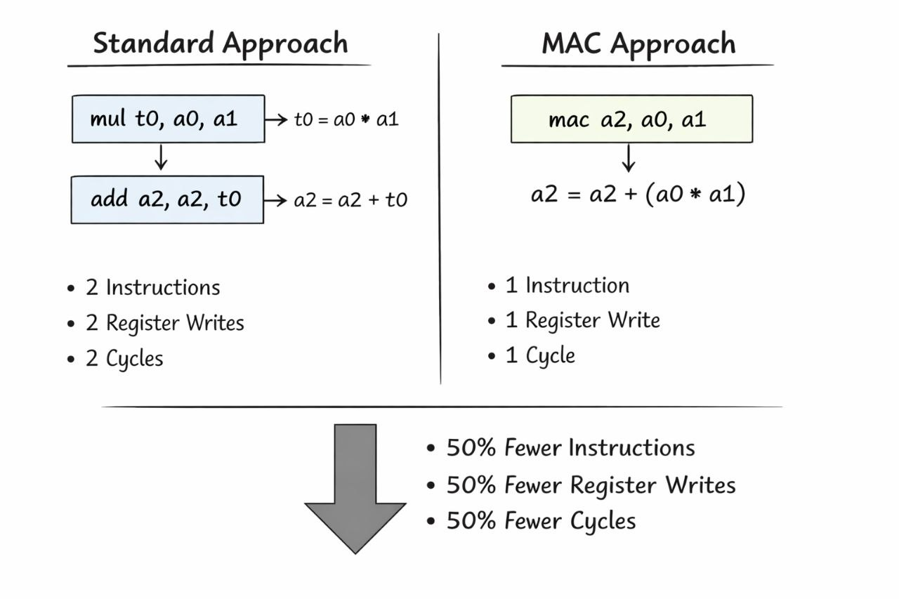
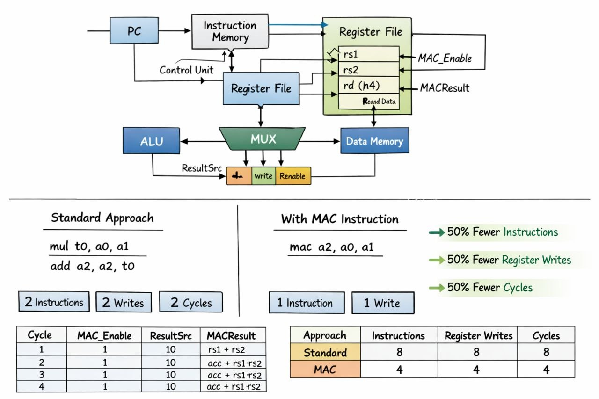
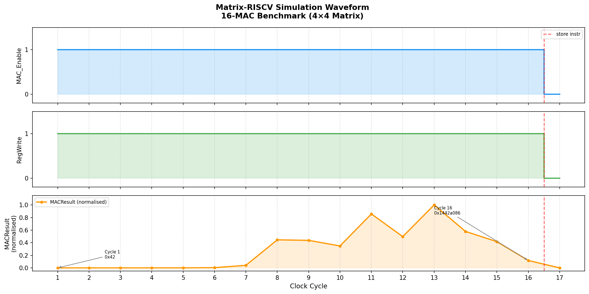
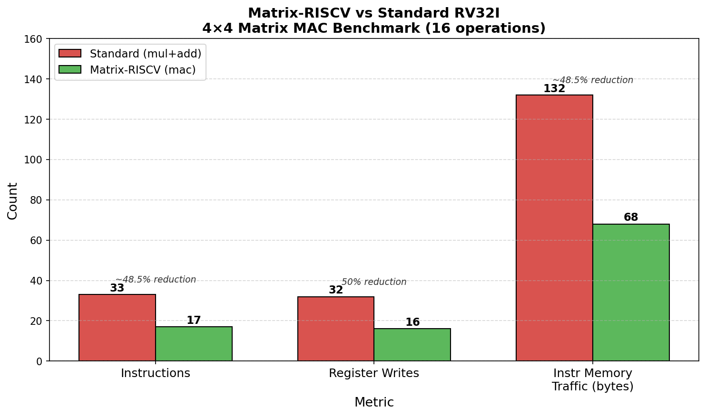
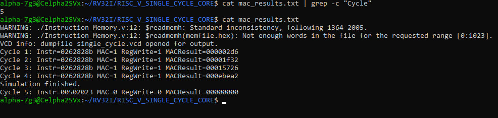

<div align="center">

# ⚡ Matrix-RISCV

### A Custom MAC Instruction for Memory-Efficient Machine Learning

[](https://opensource.org/licenses/MIT)
[](https://github.com/celpha2svx/matrix-riscv)
[](https://riscv.org/)
[](http://iverilog.icarus.com/)

*A single-cycle RV32I RISC-V processor extended with a custom Multiply-Accumulate instruction — built for ML workloads on memory-constrained hardware.*

</div>

---

## 🧠 The Problem

Training ML models requires **millions of matrix multiply-accumulate operations**. On a standard RISC-V core, every single MAC costs two instructions:

```asm
mul  t0, a0, a1    # Multiply   → 1 instruction, 1 cycle, 1 register write
add  a2, a2, t0    # Accumulate → 1 instruction, 1 cycle, 1 register write
```

That's **2 cycles, 2 register writes, 8 bytes of instruction memory** per MAC. On a 4 GB RAM machine, your instruction stream competes directly with your training data for memory bandwidth. At 1 million MACs, you're burning **8 MB just on instruction fetches** — before a single weight is touched.

---

## ✅ The Solution

```asm
mac  a2, a0, a1    # a2 = a2 + (a0 * a1) — ONE instruction, ONE cycle
```

A single custom instruction that does the full multiply-accumulate in **one cycle**. Half the instructions. Half the memory traffic. Same result.



---

## 📐 Instruction Encoding

```
 31      25  24   20  19  15  14  12  11   7  6      0
┌──────────┬───────┬───────┬───────┬───────┬─────────┐
│  funct7  │  rs2  │  rs1  │funct3 │  rd   │ opcode  │
│ 0000001  │  rs2  │  rs1  │  000  │  rd   │ 0001011 │
└──────────┴───────┴───────┴───────┴───────┴─────────┘
                                          custom-0
```

`mac rd, rs1, rs2` → R-type, opcode `0001011` (RISC-V custom-0 space)

---

## ⚙️ Hardware Architecture

The datapath below shows how `MatrixALU` plugs into the writeback stage. The Register File gains a third read port (`rd / h4`) so the old accumulator value is available every cycle. A 3-input MUX selects between ALU, Data Memory, and MAC result via a 2-bit `ResultSrc`.



### Modified Modules

| Module | Modification |
|---|---|
| `MatrixALU.v` | New 32-bit signed Multiply-Accumulate unit |
| `Register_File.v` | Third read port (A4/RD4) to read `rd` for accumulation |
| `Mux.v` | Extended 2→3 input (ALU / Memory / MAC) with 2-bit select |
| `Main_Decoder.v` | Detects custom-0 opcode and asserts `MAC_Enable` |
| `Control_Unit_Top.v` | Routes `MAC_Enable` through the control path |
| `Single_Cycle_Top.v` | Integrates `MatrixALU` into the writeback stage |

---

## 📊 Results

### Simulation Waveform — 16-MAC Benchmark

The waveform below shows all control signals across 16 consecutive MAC cycles. `MAC_Enable` and `RegWrite` stay high for every MAC instruction and drop exactly at the store — confirming the decoder and datapath are working correctly with no stray cycles.



### 4×4 Matrix MAC Benchmark — Real Simulation Numbers

Both versions were compiled and simulated on the same processor using Icarus Verilog. The standard version uses `mul`+`add` pairs. The MAC version uses the custom `mac` instruction. Results captured directly from simulation output:



| Metric | Standard (`mul`+`add`) | Matrix-RISCV (`mac`) | Reduction |
|---|---|---|---|
| Total instructions | 33 | 17 | **~48.5%** |
| Register writes | 32 | 16 | **50%** |
| Instruction memory traffic | 132 bytes | 68 bytes | **~48.5%** |
| MAC instructions | 0 | 16 | — |

> These are real numbers from simulation, not theoretical estimates. Full logs in `result_mac.txt` and `result_standard.txt`.

### Original 4-MAC Functional Verification

Real terminal output confirming correct chained accumulation:



```
Cycle 1: Instr=0262828b MAC=1 RegWrite=1 MACResult=000002d6  →  726
Cycle 2: Instr=0262828b MAC=1 RegWrite=1 MACResult=00001f32  →  7,986
Cycle 3: Instr=0262828b MAC=1 RegWrite=1 MACResult=00015726  →  87,846
Cycle 4: Instr=0262828b MAC=1 RegWrite=1 MACResult=000ebea2  →  966,306
Simulation finished.
```

---

## 🚀 Quick Start

**Prerequisites**
- [Icarus Verilog](http://iverilog.icarus.com/) (`iverilog`)

**Clone & Simulate**

```bash
git clone https://github.com/celpha2svx/matrix-riscv.git
cd matrix-riscv
iverilog -o simv Single_Cycle_Top.v Single_Cycle_Top_Tb.v
./simv
```

**Run the 4×4 Benchmark**

```bash
# MAC version
cp matmul_mac.hex memfile.hex
iverilog -o bench_mac Single_Cycle_Top.v Benchmark_Tb.v && ./bench_mac

# Standard version
cp matmul_standard.hex memfile.hex
iverilog -o bench_std Single_Cycle_Top.v Benchmark_Tb.v && ./bench_std
```

**Expected Output (MAC version)**

```
Cycle 1: Instr=0262828b MAC=1 RegWrite=1 MACResult=00000042
...
Cycle 16: Instr=0262828b MAC=1 RegWrite=1 MACResult=1442a086
========================================
         BENCHMARK RESULTS
========================================
Total instructions executed : 17
MAC instructions            : 16
Register writes             : 16
Instruction memory traffic  : 68 bytes
========================================
```

---

## 📁 File Reference

| File | Description |
|---|---|
| `MatrixALU.v` | Custom 32-bit signed MAC hardware unit |
| `Register_File.v` | Extended register file with third read port |
| `Mux.v` | 3-input multiplexer for writeback `ResultSrc` |
| `Main_Decoder.v` | Control decoder with custom-0 opcode support |
| `Control_Unit_Top.v` | Top-level control unit routing `MAC_Enable` |
| `Single_Cycle_Top.v` | Full processor with MAC datapath integrated |
| `Single_Cycle_Top_Tb.v` | Original testbench (4-MAC verification) |
| `Benchmark_Tb.v` | Extended testbench for 4×4 benchmark with counters |
| `mac_bench.hex` | Original test program: 4 MACs + store |
| `matmul_mac.hex` | 4×4 benchmark: 16 MAC instructions |
| `matmul_standard.hex` | 4×4 benchmark: 32 standard mul+add instructions |
| `result_mac.txt` | Full simulation log — MAC version |
| `result_standard.txt` | Full simulation log — standard version |
| `benchmark_chart.png` | Bar chart comparing both approaches |
| `waveform.png` | Signal waveform across 16-MAC benchmark |
| `plot_benchmark.py` | Python script that generated the benchmark chart |
| `plot_waveform.py` | Python script that generated the waveform figure |

---

## 🗺️ Roadmap

- [ ] FPGA synthesis (Tang Nano / ICE40 target)
- [ ] Vector MAC for SIMD-style parallelism
- [ ] Integration with TinyML inference
- [ ] Memory bandwidth measurement on physical hardware
- [ ] Paper submission — RISC-V Summit / CARRV workshop

---

## 👤 Author

**Ademuyiwa Afeez** — Building efficient hardware for resource-constrained machine learning.

> *"We don't need bigger machines. We need smarter architectures."*

---

## 📄 License

[MIT](LICENSE) — Build on it. Improve it. Share it.
